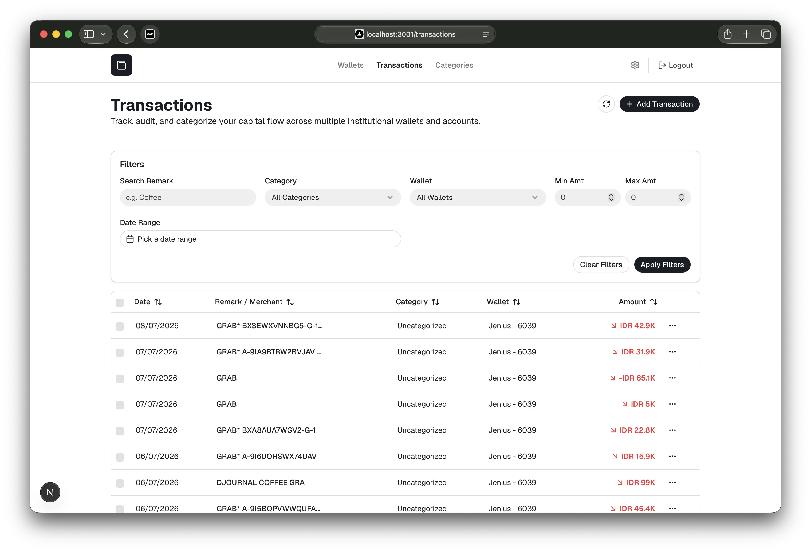

# SpenderNote

<p style="display: flex; justify-content: center;">
  <a href="https://keynesfariz.github.io/writings/spendernote-part-1-journey/">
    
  </a>
</p>

> A personal finance tracker that extracts transactions directly from your email receipts.

SpenderNote is a personal finance and budget tracking application. Instead of manually entering every expense, SpenderNote integrates with your Gmail inbox (via Gmail API) and automatically parses transaction notification emails using custom templates from your banks and e-wallets, categorizing and storing them for easy tracking.

## Why This Exists

Manual expense tracking is tedious and prone to abandonment. By connecting directly to the transactional emails you already receive from banks and digital wallets, SpenderNote removes the friction of data entry and gives you a real-time view of your finances without the manual work.

## Features

- **Expense Tracking**: Connects to your email via the Gmail API to find transaction receipts and notifications.
- **Flexible Parsing Modes**: Choose between cost-free, custom regex-based templates or a powerful AI parser (using Gemini/Groq) to extract transaction details based on your preference.
- **Dashboard & Insights**: View your spending habits, manage wallets, and track budgets.
- **Manual Adjustments**: Bulk update tools and merge functionality for duplicate wallets or handling failed transactions.

## Prerequisites

Before installing, ensure you have the following set up:

- **[Bun](https://bun.sh/)**: Installed locally (required for package management).
- **[Supabase](https://supabase.com/)**: A Supabase project with PostgreSQL database.
- **Google Cloud Console**: A GCP project with the **Gmail API** enabled, an OAuth client created, and appropriate email read scopes configured (`https://www.googleapis.com/auth/gmail.readonly`).

## Installation

**1. Clone the repository**

```bash
git clone https://github.com/keynesfariz/spender-note.git
cd spender-note
```

**2. Install dependencies**

```bash
bun install
```

**3. Configure Environment Variables**

Create a `.env.local` file in the root directory and populate it with your credentials:

```env
# Supabase
DATABASE_URL=your_supabase_db_url
NEXT_PUBLIC_SUPABASE_URL=your_supabase_url
NEXT_PUBLIC_SUPABASE_PUBLISHABLE_KEY=your_supabase_publishable_key

# Parser Configuration
PARSER_MODE=regex # Options: regex or ai

# AI Provider Keys (Required only if PARSER_MODE=ai)
GEMINI_API_KEY=your_gemini_key
GROQ_API_KEY=your_groq_key

# Gmail API OAuth credentials
GOOGLE_CLIENT_ID=your_google_client_id
GOOGLE_CLIENT_SECRET=your_google_client_secret
```

**4. Database Setup**

Generate the migration files and apply them to your Supabase database:

```bash
bun run db:generate
bun run db:migrate
# Or use db:push to push schema directly without migrations
# bun run db:push
```

## Quick Start

Start the development server:

```bash
bun run dev
```

Open [http://localhost:3000](http://localhost:3000) with your browser to see the app.

## Future Development

- **Design Revamp**: We are currently in the process of a major UI/UX overhaul. Our goal is to make the app cleaner, easier to use, and heavily focused on the user experience.
- **Advanced AI Insights**: Expanding the dashboard capabilities to include deeper, AI-driven insights into your spending habits and financial patterns.

## License

MIT
